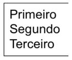
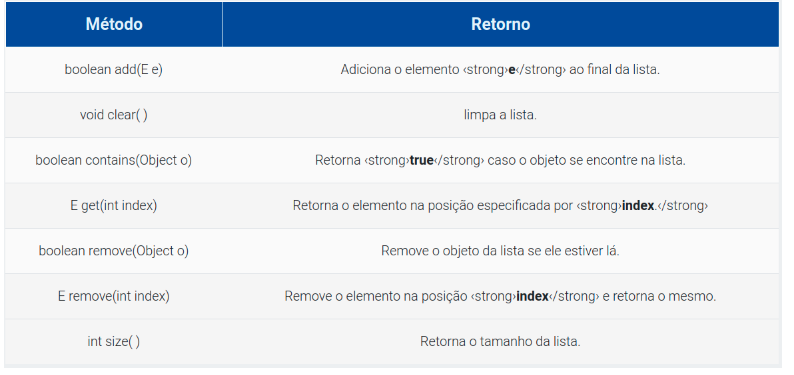
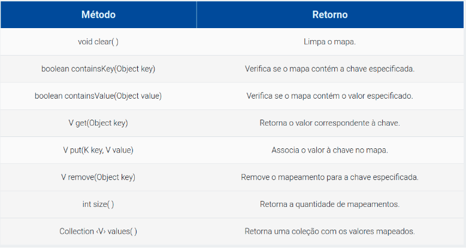
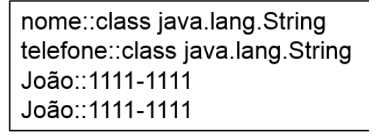

## Aula 3 - Exceções e elementos comportamentais

### Exceções

Muitas vezes temos que preparar nossos sistemas para a possibilidade de ocorrência de erros durante a execução, podendo ocorrer pela indisponibilidade de algum recurso, como rede ou espaço em disco, pela entrada de dados em formato incorreto, entre diversas outras situações.

Outro assunto muito relevante para os sistemas atuais é a utilização de modelagem comportamental, aumentando o reuso de processos e estruturas, o que pode ser feito no ambiente Java por meio de classes genéricas ou pelo uso de anotações. Inclusive, uma importante biblioteca Java para o manuseio de coleções apresenta uma implementação atual baseada em classes genéricas.

Nos ambientes orientados a objetos, os diversos erros de execução são encapsulados em classes especiais denominadas exceções.

Temos a classe básica Exception, que define apenas um código de erro e uma mensagem, voltada para erros genéricos.

A partir desta classe, e utilizando o mecanismo de herança, são definidas exceções mais específicas, com maior gama de informações acerca do erro.


Para tratarmos uma exceção devemos utilizar uma estrutura de fluxo específica, baseada no comando try (tentar), o qual utiliza a seguinte sintaxe:

```java

try {

  // Bloco de comandos protegido

} catch (IOException e1) {

  // Tratamento de erro de IO

} catch (Exception e2) {

  // Tratamento de erro genérico

} finally {

  // Execução obrigatória, independente da ocorrência de erros

}

```

Inicialmente é executado o bloco protegido pelo comando try, e se ocorre uma exceção do tipo IOException, ela é capturada em e1 com o uso de catch(IOExeption e1), sendo executado o tratamento de erro de IO e seguindo para o bloco do finally.

Para qualquer outro tipo de exceção, será executado o bloco para tratamento de erro genérico, com a captura do erro em e2, e seguindo para finally ao término. Lembrando que, segundo a orientação a objetos, qualquer descendente pode ser utilizado no lugar da classe original, o que viabiliza essa funcionalidade.

Se invertermos a ordem dos blocos catch ocorrerá um erro de compilação, pois o fato de Exception ser mais genérico impediria a captura de quaisquer outras exceções.

Quanto ao bloco finally, mesmo sem ocorrência de erros, ele será executado.

Um exemplo prático no qual utilizaríamos essas instruções seria na inserção de dados em um banco, onde devemos abri-lo, inserir os registros e fechar o banco. Ocorrendo ou não erros durante a inserção, o banco deve ser fechado.

```java

ABRIR_BANCO_DE_DADOS( );

try {

   INSERIR( );

   INSERIR( );

   // Diversos comandos de inserção

} catch (Exception e) {

    // Tratamento de erro genérico

} finally {

FECHAR_BANCO_DE_DADOS( );

}

```

Para qualquer exceção não silenciosa, o compilador considerará como erro caso a possibilidade de ocorrência da mesma não seja tratada. Nesses casos precisamos utilizar a estrutura try..catch, ou avisar ao compilador que não será tratado, mas sim ecoado para o chamador do método, por meio da assinatura com throws.

Também podemos criar nossas próprias exceções, de forma a utilizá-las como sinalizações de erros específicos de nossos sistemas.

```java

public class ErroCalc extends Exception{

  public ErroCalc(int a, int b){

    super("Erro com os numeros "+a+" e "+b);

  }

}


```

Em nossa exceção personalizada (ErroCalc) temos um construtor que recebe dois valores inteiros, e chama o construtor de Exception, com o uso de super, passando a mensagem correta.

Esta exceção poderia ser utilizada em uma classe de nosso sistema.

```java

public class Calculadora {

  public int somar(int a, int b){

    return a+b;

  }


  public int dividir(int a, int b) throws ErroCalc {

    if(b==0)

      throw new ErroCalc(a, b);

    return a/b;

  }

}

```

No caso da classe Calculadora, temos os métodos somar, onde não ocorre exceção, e dividir, que gera ErroCalc quando o parâmetro b tem valor zero. Note que não basta alocar o objeto ErroCalc com new, sendo necessário o uso do comando throw para lançar a exceção.

Caso não ocorra tratamento com try..cath, ao lançar ErroCalc a execução de dividir é imediatamente interrompida, retornando ao chamador, sendo também necessário informar ao compilador que esse método pode gerar uma exceção desse tipo com o uso do comando throws em sua assinatura.

Podemos testar facilmente nossa exceção com o uso de um objeto do tipo Calculadora.

```java

public class TesteCalc {

  public static void main(String[] args) {

    Calculadora c1 = new Calculadora();

    try {

       System.out.println(c1.somar(2, 3));

       System.out.println(c1.dividir(6, 3));

       System.out.println(c1.dividir(6, 0));

    } catch (ErroCalc e)

       System.out.println(e.getMessage());

    }

  }

}

```

Neste exemplo, a condição que irá gerar a exceção será a chamada c1.dividir(6,0), mas mesmo que não colocasse o valor zero, o compilador exigiria o tratamento, já que dividir assinala uma possibilidade de exceção com throws ErroCalc.

A saída que obteremos será a seguinte:


### O que é modelagem comportamental?

Em muitas situações não conseguimos expressar a realidade por meio de simples objetos.

Para uma situação desse tipo, não importa qual carro esteja entrando ou saindo, mas sim que o trecho esteja engarrafado. Logo, não são os objetos que definem a abstração principal, mas sim o comportamento.

Poderíamos dizer o mesmo sobre uma fila. Você pode ter uma sequência de pessoas, elefantes, carros, ou qualquer outra coisa, e todas essas sequencias organizadas seriam filas, independente dos objetos que as constituem.

Essa generalização também pode ser feita para uma pilha de pratos ou de livros, pois não importa de qual tipo de objeto se trate, e sim que estejam empilhados.

Na programação utilizamos diversos comportamentos, normalmente definidos por estruturas de dados, como as próprias Filas e Pilhas, por exemplo.

Em termos de orientação a objetos, existem duas ferramentas que permitem a implementação de modelos comportamentais: Classes Genéricas e Anotações.

### Classes genéricas

As classes genéricas, também chamadas de classes template, já tinham sido idealizadas no início da orientação a objetos, e eram comuns em linguagens como o C++, mas veio para o Java em versões um pouco mais recentes por intermédio dos Generics.

Quando criamos uma classe genérica estamos modelando um comportamento com lacunas bem definidas ao qual serão atribuídas classes para preencher tais lacunas e completar a funcionalidade abstrata previamente definida.

Vamos observar um exemplo.

```java

package exemplo020;

  public class Pilha‹;K›; {

   class NoPilha‹;K›; {
      K dado;
      NoPilha‹;K›; proximo;
   }

   private NoPilha‹;K›; topo = null;

   public void empilhar(K dado){
      NoPilha‹;K›; novo = new NoPilha<>();
      novo.dado = dado;
      novo.proximo = topo;
      topo = novo;
   }

   public K desempilhar(){
      if(topo==null)
         return null;
      NoPilha‹;K›; antigo = topo;
      topo = topo.proximo;
      return antigo.dado;
   }

}

```

Neste exemplo foi definida uma classe genérica de Pilha, com os métodos para empilhar e desempilhar (push/pop), podendo ser observada a presença da lacuna definida pela letra K. Na verdade poderia ser qualquer letra, devendo apenas ser colocada junto ao nome da classe. `public class Pilha‹K›`

A letra K representa algo genérico e será substituída em todas as ocorrências posteriores quando definirmos o tipo de objeto a ser utilizado.

Por exemplo, se utilizarmos String, o método empilhar pode ser lido da seguinte forma:

```java

public void empilhar(String dado){

     NoPilha ‹String› novo = new NoPilha‹›();

     novo.dado = dado;

     novo.proximo = topo;

     topo = novo;

}

```

É interessante observar também a definição de uma inner class chamada NoPilha, ou seja, uma classe utilitária interna, que só pode ser utilizada na programação da classe Pilha. Na prática ela auxilia na construção de uma estrutura de pilha típica, onde um valor é colocado no topo, e deve apontar para o elemento logo abaixo na pilha (proximo).


Sempre devemos lembrar que a pilha trata de uma estrutura LIFO (Last In First Out), o que significa que o último a entrar é o primeiro a sair. Isto faz sentido se fizermos uma analogia com uma pilha de pratos, já que não é possível pegar o prato de baixo sem que os demais caiam.

Agora podemos criar um programa para testar nossa classe de Pilha.

```java

package exemplo020;
public class Exemplo020 {
   public static void main(String[] args) {
      Pilha pilha1 = new Pilha<>();
      pilha1.empilhar(5);
      pilha1.empilhar(7);
      pilha1.empilhar(9);
      Integer x;
      while((x=pilha1.desempilhar())!=null)
      System.out.println(x);
   }
}

```

Esse programa inicialmente cria uma Pilha de elementos Integer (classe wrapper para ı), e em seguida empilha os valores 5, 7 e 9.

Observando o que ocorre a seguir, vemos a declaração de uma variável x que receberá os valores desempilhados, enquanto esse valor for diferente de nulo, imprimindo x a cada rodada.

Por se tratar de uma estrutura LIFO, é natural que os números sejam impressos na ordem inversa da entrada, ou seja, serão impressos os valores 9, 7 e 5.

### Coleções

As coleções são de grande importância para o Java, sendo organizadas pela Oracle em um grupo denominado JCF (Java Collections Framework), o qual foi todo implementado com o uso de classes genéricas.

Ao contrário de vetores, que apresentam um número de elementos fixo, as coleções funcionam internamente como listas encadeadas, e permitem que objetos sejam adicionados ou removidos a qualquer momento.

Nós podemos verificar a relevância dessa família de classes pelo simples fato de ter sido criada uma nova funcionalidade para a estrutura for baseada em coleções, e que posteriormente foi expandida para vetores.

Em outras linguagens existem estruturas foreach, com funcionamento similar, e a leitura que devemos fazer é “para cada elemento pertencente à coleção”.

A sintaxe básica seria a seguinte:

```java

for( Classe obj: Coleção ‹Classe› ) {

     // Bloco de instruções

}

```

Uma Collection é uma classe abstrata e que, portanto, não pode ser utilizada diretamente, mas nós podemos instanciar os seus diversos descendentes com funcionalidades específicas.

Podemos observar, a seguir, um exemplo de uso de ArrayList, descendente de Collection.

```java

package exemplo021;
import java.util.ArrayList;
public class Exemplo021 {
   public static void main(String[] args) {
      ArrayList‹String› lista = new ArrayList<>();
      lista.add("Primeiro");
      lista.add("Segundo");
      lista.add("Terceiro");
      for(String x: lista){
         System.out.println(x);
      }
   }
}

```

Neste exemplo é criada uma coleção do tipo ArrayList, com elementos do tipo String, e em seguida adicionamos três elementos nessa coleção com o uso do método add.

Depois de adicionados os elementos, podemos percorrer a lista com uso do for, e a variável x receberá o primeiro valor da lista na primeira rodada, em seguida, o segundo e finalmente o terceiro, imprimindo o valor recebido a cada rodada.

Com isso teremos a seguinte saída:



Nas versões atuais do Java é possível também utilizar operadores lambda, segundo o paradigma funcional, e o trecho voltado para a impressão dos valores poderia ser escrito da seguinte forma:

```java

lista.forEach((x) -> {

     System.out.println(x);

     });

```

Os principais métodos do ArrayList‹E› são apresentados no quadro abaixo:



Dentre as diversas outras classes do JCF, além do ArrayList outra de grande utilização é HashMap. Com o uso desta classe é possível estabelecer relações do tipo chave-valor com muita facilidade.

Se quisermos fazer um controle no qual temos o código de nossos produtos no formato inteiro e os nomes no formato texto, poderemos declarar o HashMap da seguinte forma: `HashMap ‹ Integer, String > produtos = new HashMap‹›( );`

Observando a declaração do HashMap, vemos que devem ser colocadas na tipificação dele a classe da chave e a classe do dado (valor).

```java

package exemplo022;
import java.util.HashMap;
import java.util.Scanner;
public class Exemplo022 {
   public static void main(String[] args) {
      Scanner teclado = new Scanner(System.in);
      HashMap‹Integer,String› produtos = new HashMap<>();
      int opcao;
      do{
         System.out.println("Digite 1 para incluir, "+
                           "2 para consultar, 0 para sair");
         opcao = teclado.nextInt();
         switch(opcao){
            case 1:
               System.out.println("Código do novo produto:");
               int codigoN = teclado.nextInt();
               System.out.println("Nome do novo produto:");
               String nomeN = teclado.next();
               produtos.put(codigoN, nomeN);
               break;
            case 2:
               System.out.println("Digite o código:");
               int codigo = teclado.nextInt();
               String nome = produtos.get(codigo);
               if(nome!=null)
                  System.out.println(nome);
               break;
         }
      } while(opcao!=0);
   }
}

```

Nesse programa utilizamos uma estrutura de repetição do tipo do..while, onde é solicitada ao usuário qual ação ele deseja efetuar, sendo 1 referente à inclusão de um produto, 2 para a consulta e 0 para encerrar a execução.

Ao escolher a opção 1, será executado o primeiro bloco do switch..case, onde iremos solicitar o código e o nome do novo produto, procedendo a inclusão dele no HashMap com o uso do método put.

Se a opção escolhida for 2, solicitaremos o código do produto e buscaremos o nome dele no HashMap por meio do método get, o qual poderá retornar o nome, ou nulo no caso em que a chave não estiver presente nesse HashMap.

Podemos observar, a seguir, uma possível saída para esse programa.


Os principais métodos do HashMap ‹K,V› são apresentados no quadro seguinte:



Nós vimos aqui apenas os dois principais elementos do JCF, mas existem muitas outras classes disponíveis nessa biblioteca.

É interessante observar também que, como estruturas de dados, tais elementos podem ser combinados para criar, por exemplo, listas de mapas de listas.

`ArrayList‹ HashMap‹ Integer, ArrayList‹String› > >`

Esta estrutura de exemplo, um pouco mais complexa, permitiria guardar coleções de tabelas de mapeamento, onde cada mapeamento se refere a uma coleção.

### Reflexividade Computacional

Podemos definir reflexividade computacional como a habilidade de um objeto conhecer a si próprio, sua estrutura e a utilização de seus métodos.

Na linguagem Java os objetos derivam direta ou indiretamente da classe Object, que seria a classe base de toda a plataforma. No entanto, existe outra classe chamada Class, que permite observar a estrutura de qualquer objeto por meio da reflexividade.

Não confundir a palavra reservada class (minúsculo) para definição de classes com a classe Class (maiúsculo) para gerência de classes.

Por meio de Class podemos obter informações acerca dos atributos da classe em objetos do tipo Field e de seus métodos por meio de objetos Method e Parameter.

Além de consultar as informações, podemos mudar o valor de atributos e invocar métodos com o uso destas classes.

Vamos observar um pequeno exemplo, com uma classe Pessoa definida de forma simples.

```java

package exemplo023;
public class Pessoa {
     public String nome;
     public String telefone;

     public void exibir(int quantidade){
          for(int i=0; i ‹ quantidade; i++)
               System.out.println(nome+"::"+telefone);
     }
}

```

```java

package exemplo023;
import java.lang.reflect.Field;
public class Exemplo023 {
     public static void main(String[] args) throws Exception {
          Object objeto =
               Class.forName("exemplo023.Pessoa").newInstance();
          Class classe = objeto.getClass();
          // Reconhecendo os atributos do objeto...
          for(Field f: classe.getFields())
              System.out.println(f.getName()+"::"+f.getType());
          // Alterando os valores e invocando o método...
          classe.getField("nome").set(objeto,"João");
          classe.getField("telefone").set(objeto,"1111-1111");
          classe.getMethod("exibir", int.class).invoke(objeto, 2);
     }
}

```

Note que no exemplo o objeto da classe Pessoa é criado a partir de seu nome completo, incluindo o pacote, no formato texto, e que conseguimos extrair os atributos com objetos Field. Qualquer nome de classe que fosse utilizado iria funcionar e mostraria os atributos definidos no âmbito da classe.

Uma observação a ser feita é a de que o método main acrescenta throws Exception em sua assinatura. Isto é necessário porque o método forName pode gerar uma exceção caso não encontre o nome da classe passada como parâmetro no CLASSPATH.

Além de obter os dados acerca dos atributos, também alteramos os valores dos campos com o comando set. Abaixo, podemos observar uma linha com método set desdobrada para melhor compreensão.

```java

Field f = classe.getField("nome");
     // Captura o atributo nome da classe no Field f
f.set(objeto, "João");
     // Utiliza o método set para alterar o valor em objeto.

```

Finalmente, invocamos um método passando parâmetros para o mesmo com o uso do invoke. Novamente vamos desdobrar a linha para facilitar a compreensão.

```java

Method m = classe.getMethod("exibir", int.class);
     // Captura a versão do método exibir que recebe um valor
     // inteiro como parâmetro
m.invoke(objeto,2);
     // Invoca este método passando o valor 2 para o parâmetro.

```

Podemos observar, a seguir, a saída esperada para a execução desse código:



### Anotações

Por que falamos acerca de reflexividade computacional?

Certamente é um assunto complexo, mas necessário para compreender os fundamentos da criação e utilização de anotações.

As anotações são metadados anexados às classes que podem ser reconhecidos por ferramentas externas para as mais diversas finalidades. Atualmente, é comum seu uso em diversos frameworks, principalmente os de persistência de dados.

Sem a reflexividade computacional essas ferramentas não conseguiriam reconhecer tais anotações em meio ao código da classe.

Essa é uma modelagem comportamental que segue o caminho inverso das classes genéricas, pois nessas primeiras as classes são aplicadas ao comportamento, enquanto nas anotações iremos aplicar o comportamento às classes.

```java

package exemplo024;
import java.lang.annotation.ElementType;
import java.lang.annotation.Retention;
import java.lang.annotation.RetentionPolicy;
import java.lang.annotation.Target;

@Retention(value=RetentionPolicy.RUNTIME)
@Target(value=ElementType.TYPE)
public @interface Autoria {
    String autor();
    int ano();
    String empresa() default "UNESA";
}

```

Para definir uma anotação precisamos utilizar o comando @interface, além de definir a utilização dela com @Target, e neste exemplo indica que a anotação será voltada para classes, mas que poderiam ser diversos outros tipos, como métodos e atributos, bem como o escopo de utilização com @Retention, colocado aqui como em tempo de execução.

Para essa anotação criamos três campos, sendo que dois são de preenchimento obrigatório e um opcional, no caso empresa, já que é definido um valor padrão com default.

Após criar nossa interface de anotação, podemos aplicá-la a uma classe.

```java

package exemplo024;
@Autoria(autor = "Denis", ano = 2018)
public class Carro {
      // O código interno da classe não será criado
}

```

Note que o uso da aplicação é bastante simples, assemelhando-se muito a um comentário, mas necessitando sempre do preenchimento de campos obrigatórios.

O passo final é o mais complexo, justamente por necessitar de elementos de reflexividade computacional, e trata do reconhecimento das anotações pelas ferramentas externas.

O processo demonstrado a seguir é o mesmo utilizado pelos frameworks na automatização de diversas atividades.

```java

package exemplo024;
  public class Exemplo024 {
     public static void main(String[] args) {
      Object[] objetos = {new Carro(), "XPTO" };
      for(Object obj: objetos){
         Class c1 = obj.getClass();
         if(c1.isAnnotationPresent(Autoria.class)){
            Autoria a1 =
                 (Autoria)c1.getAnnotation(Autoria.class);
            System.out.println("Classe " + c1.getName() +
                 " escrita por " + a1.autor() + " em " +
                 a1.ano());
         } else {
            System.out.println("Classe " + c1.getName() +
               " sem autoria definida");
         }
      }
   }
}

```

Incialmente definimos um vetor de objetos, recebendo um Carro e uma String, e nesse caso apenas o Carro traz a anotação de Autoria.

Ao percorrer o vetor, para cada Object do mesmo iremos obter o Class, e em seguida perguntar se a anotação de Autoria está presente.

`if(c1.isAnnotationPresent(Autoria.class))`

Estando presente iremos capturar a anotação encontrada, sendo necessário uma conversão de tipo, já que o método retorna uma anotação de forma genérica.

`Autoria a1 = (Autoria)c1.getAnnotation(Autoria.class); // Conversão de tipo com (Autoria)`

Com isso conseguimos imprimir os valores digitados para autor e ano, ou a mensagem de que a autoria não está definida quando a anotação não está presente.

Podemos observar a saída do programa a seguir:

```java

Classe exemplo024.Carro escrita por Denis em 2018

Classe java.lang.String sem autoria definida

```
