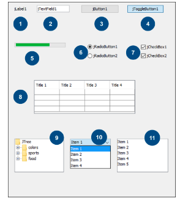

## Aula 4 – Interfaces visuais para desktop

### GUI (Graphical User Interface)

Os primeiros computadores pessoais trabalhavam no modo texto, com comandos simples de entrada e saída para interação com vídeo e teclado e até mesmo jogos eram feitos com caracteres ASCII.

Os pesquisadores da Xerox foram pioneiros na criação de interfaces gráficas, definindo conceitos que persistem até os dias atuais, como janelas, menus, caixas de opção, caixas de seleção e ícones.

As empresas Apple e Microsoft seguiram as ideias definidas pela Xerox na criação de suas interfaces gráficas, sendo o Macintosh lançado em 1984, o qual se tornou o primeiro produto de sucesso a utilizar uma interface gráfica.

No caso da Microsoft, as interfaces gráficas inicialmente eram chamadas a partir do MS-DOS, recebendo o nome de Windows, e foi somente a partir de 1990, com a versão 3.0, que este sistema de janelas se popularizou.

Outras plataformas também passaram a disponibilizar ambientes baseados em janelas, como XWindow no UNIX e Linux, Workbench no Commodore Amiga, e GEM nos computadores Atari.

Qualquer que seja a GUI, ela deve utilizar um conjunto de tecnologias visando à criação de uma plataforma de interação com o usuário.

Em computadores pessoais, o conjunto padrão é denominado WIMP (window, icon, menu, pointer), ou seja, é um ambiente composto de janelas, ícones, menus e ponteiros. Nesse sistema, utiliza-se um dispositivo de ponteiro como o mouse para controlar a posição do cursor e apresentar informação organizada em janelas e representada por meio de ícones.

Em ambientes WIMP, os gerenciadores de janelas facilitam a interação entre as representações gráficas, aplicações e o sistema de gerenciamento de hardware. A sensação proporcionada por estes gerenciadores de janelas, incluindo a interação entre janelas e outros elementos gráficos, produz um ambiente denominado desktop.

### Bibliotecas gráficas do Java

O ambiente Java traz, por padrão, duas bibliotecas que objetivam a criação de sistemas baseados em janelas:

awt (Abstract Window Toolkit),
trata da API original do Java para GUI.

swing, parte da JFC
(Java Foundation Classes).

Existe também uma terceira biblioteca denominada swt (Standard Widget Toolkit), criada pela IBM e mantida pela Eclipse Foundation.

Nós utilizaremos a biblioteca swing, por ser padrão do ambiente Java e por definir o aspecto para os componentes visuais de forma independente, ao contrário do awt, que exibe os componentes de acordo com o aspecto proporcionado pela plataforma ou pelo sistema operacional.

Nas bibliotecas swing e awt temos componentes visuais como botões, campos de texto e listas, voltados para a interação com o usuário, e componentes chamados de contêineres, responsáveis por agrupar os componentes iniciais.

O principal contêiner é a janela, e dentro dela podemos ter botões e outros componentes visuais simples, bem como painéis, que podem agrupar outros componentes visuais e painéis de forma recursiva.

Para ajustar a forma como estes componentes serão dispostos sobre o contêiner, devemos utilizar os componentes de layout.

Vamos ilustrar este processo no exemplo seguinte.

```java

import java.awt.BorderLayout;

import java.awt.Button;

import java.awt.FlowLayout;

import java.awt.HeadlessException;

import javax.swing.JFrame;

import javax.swing.JPanel;


public class MinhaJanela extends JFrame{


public MinhaJanela() throws HeadlessException {

super("Apenas um teste");

setLayout(new BorderLayout());

setBounds(10, 10, 300, 200);

JPanel jp = new JPanel(new FlowLayout());

jp.add(new Button("OK"));

jp.add(new Button("Cancela"));

add(jp,"South");

}


public static void main(String[] args) {

new MinhaJanela().setVisible(true);

}

}


```

Neste exemplo nós criamos uma classe descendente de JFrame, que na prática seria uma janela, e efetuamos algumas configurações.

Inicialmente chamamos o construtor do pai com a passagem do título da janela, definimos o layout como BorderLayout (dividido em Norte, Sul, Leste, Oeste e Centro), e definimos a posição, altura e largura com uso de setBounds.

Em seguida foi criado um painel com layout sequencial (FLowLayout), sendo adicionados dois botões a este painel, o qual é finalmente adicionado à janela na posição Sul.

O resultado você confere na imagem.


Apenas um teste
Cancela I

Podemos verificar alguns layouts disponíveis na tabela seguinte.


O método main irá apenas instanciar um objeto de janela e torná-lo visível.

Além das janelas criadas com JFrame podemos definir caixas de diálogo com JDialog, e utilizar alguns diálogos padronizados com JOptionPane. Iremos utilizar os diálogos nas situações em que fazemos uma pergunta ao usuário, ou quando desejarmos informá-lo acerca de algo.

Até mesmo em sistemas de linha de comando podemos utilizar os diálogos, e o componente JOptionPane já traz boa parte das necessidades usuais de entrada de dados para um sistema deste tipo.


Vamos observar um pequeno exemplo de utilização do JOptionPane.

```java

import javax.swing.JOptionPane;


public class ExemploOptionPane {


public static void main(String[] args) {

int a = new Integer(

JOptionPane.showInputDialog("Primeiro Numero:"));

int b = new Integer(

JOptionPane.showInputDialog("Segundo Numero:"));

int c = a + b;

JOptionPane.showMessageDialog(null, "A soma será: "+c, "Soma",

JOptionPane.INFORMATION_MESSAGE);

}

}


```

A sequencia de execução resultará na exibição dos seguintes diálogos:


Neste pequeno exemplo temos o uso do método showInputDialog para solicitar os valores ao usuário, os quais devem ser convertidos para inteiro, pois são recebidos como texto. Em seguida, efetuamos a soma dos números fornecidos e exibimos o resultado por meio do método showMessageDialog.

Note que o parâmetro JOptionPane.INFORMATION_MESSAGE fará com que apareça o ícone padrão de informação na caixa de diálogo, podendo ser utilizados também outros ícones.


### Componentes visuais

A padronização de componentes nas diversas plataformas trouxe muitos benefícios em termos de aprendizagem para os usuários. Como as interfaces gráficas apresentam os mesmos conceitos visuais, a utilização de um novo sistema se torna intuitiva.

É importante que saibamos utilizar os diversos componentes visuais para a construção de nossas telas.

Toda biblioteca GUI apresenta componentes visuais padronizados, como:

Botões: Interação com o usuário a partir da operação de clique do mouse.

Caixas de texto: Digitação de valores pelo usuário.

Elementos selecionáveis: Podem ser marcados ou desmarcados com o clique do mouse.

Listas: Representação de conjuntos de dados, podendo ser retráteis ou não.

Menus: Conjuntos de listas de ações agrupadas, localizados normalmente na parte superior da tela.

A figura seguinte mostra a maior parte destes componentes, segundo o aspecto visual proporcionado pela biblioteca swing.



Podemos ver no quadro abaixo as informações acerca dos componentes swing expostos na figura, de acordo com a numeração adotada.


Para utilizarmos estes diversos componentes deveremos saber como instanciá-los e agrupá-los de forma adequada em meio aos contêineres visuais. Alguns componentes irão exigir um modelo de programação mais robusto, particularmente aqueles que representam coleções de dados, como listas e árvores.

O exemplo seguinte demonstra a criação de uma janela com alguns dos componentes visuais.

```java

import java.awt.GridLayout;

import javax.swing.*;


public class JanelaSimples extends JDialog{

private JTextField txt1;

private JCheckBox chk1,chk2;

private JRadioButton rb1, rb2;

private JButton btn1, btn2;


public JanelaSimples() {

setLayout(new GridLayout(4,2));

add(new JLabel("Nome"));

add(txt1=new JTextField(10));

// Campo de Texto com 10 posições


add(new JLabel("Opções de Leitura"));

JPanel jp1 = new JPanel(new GridLayout(2,1));

jp1.add(chk1 = new JCheckBox("Revista Mensal"));

jp1.add(chk2 = new JCheckBox("Versão Digital"));

// Painel com as caixas de seleção

add(jp1);


add(new JLabel("Graduado"));

JPanel jp2 = new JPanel(new GridLayout(2,1));

jp2.add(rb1 = new JRadioButton("sim"));

jp2.add(rb2 = new JRadioButton("não"));

// Painel com os botões de rádio

bp.add(rb1);

bp.add(rb2);

// // Agrupamento dos botões de rádio

add(jp2);


add(btn1 = new JButton("OK"));

add(btn2 = new JButton("Cancela"));

}


public static void main(String[] args) {

JanelaSimples j1 = new JanelaSimples();

j1.setModal(true);

j1.setBounds(0,0, 300, 300);

j1.setVisible(true);

}

}


```

Neste exemplo nós criamos uma janela a partir de JDialog, organizando o posicionamento dos componentes com um GridLayout de 4 linhas por 2 colunas.

```java

setLayout(new GridLayout(4,2));

```


Em seguida, começamos a adicionar os componentes ao grid, preenchendo sequencialmente as posições, ou seja, os componentes vão sendo adicionados na primeira linha, e quando não há mais espaço vai para a linha seguinte, repetindo-se o processo sucessivamente.

Nos momentos em que precisamos adicionar mais de um componente em uma mesma célula, como no caso das caixas de seleção e dos botões de rádio, utilizamos JPanel com organização via GridLayout de 2 linhas por 1 coluna. Os componentes são adicionados ao JPanel, e este é adicionado ao JDialog.

```java

JPanel jp1 = new JPanel(new GridLayout(2,1));

jp1.add(chk1 = new JCheckBox("Revista Mensal"));

jp1.add(chk2 = new JCheckBox("Versão Digital"));

// Painel com as caixas de seleção

add(jp1);


```

Por fim, os botões de rádio se tornam mutuamente exclusivos apenas se estiverem pertencendo ao mesmo grupo, e por isso precisamos criar um ButtonGroup e adicionar os botões de rádio.

```java

ButtonGroup bp = new ButtonGroup();

bp.add(rb1);

bp.add(rb2);


```

A chamada para a nova janela é feita no método main, ao instanciarmos um objeto do tipo JanelaSimples, definirmos seu posicionamento e suas dimensões, e deixá-lo visível. Embora não tenha influência agora, setar como modal significa que ficará em frente à janela chamadora, em um ambiente de múltiplas janelas, evitando perder o foco.

```java

JanelaSimples j1 = new JanelaSimples();

j1.setModal(true);

j1.setBounds(0,0, 300, 300);

j1.setVisible(true);


```

Note que alguns dos componentes ficaram com dimensões um pouco estranhas, algo que pode ser corrigido com um pouco mais de código, mas como o NetBeans permite alterar visualmente este tipo de configuração, seria desnecessário aumentar a complexidade.

### Utilização de eventos

Agora que já conseguimos criar o design de nosso sistema, devemos nos preocupar com a interatividade dele, e nesse ponto precisaremos entender o conceito e uso de eventos.

Podemos definir evento como uma ação predeterminada que, ao ocorrer, permite iniciar uma ação personalizada, o que certamente será feito através de programação.

Cada linguagem apresenta sua própria versão de resposta a eventos, e no Java utilizamos a implementação de interfaces “ouvintes” para responder aos eventos.

Como existem diversos tipos de eventos disponíveis, devemos nos preocupar apenas com o ouvinte, ou listener, adequado à ação que esperamos do usuário.


Inicialmente devemos implementar a interface ouvinte desejada na janela, para permitir que os componentes possam adotá-la como ouvinte.

Vamos entender melhor com o seguinte exemplo:

Vamos considerar uma janela com dois campos de texto e um botão, como no fragmento de código seguinte.

```java

public class JanelaSoma extends JFrame {

private JTextField txt1, txt2;

private JButton btn1;


```

Nós podemos implementar uma funcionalidade na qual o clique sobre o botão irá efetuar a soma dos valores digitados nos dois campos de texto, e apresentar esta soma através de um JOptionPane.

```java

public class JanelaSoma extends JFrame implements ActionListener{


@Override

public void actionPerformed(ActionEvent e) {

Integer i1 = new Integer(txt1.getText());

Integer i2 = new Integer(txt2.getText());

JOptionPane.showMessageDialog(this, "A soma será "+(i1+i2));

}

```

Note que nossa janela agora implementa a interface ActionListener, e o processo é desenvolvido no método actionPerformed. Inicialmente são definidos os valores dos inteiros i1 e i2 a partir dos textos de txt1 e txt2, e a seguir apresentamos o JOptionPane com a soma dos dois.

Agora só falta definir o construtor da janela e atrelar o botão que receberá o clique com o método de resposta por meio de addActionListener.

```java

public JanelaSoma() throws HeadlessException {

setLayout(new FlowLayout());

add(txt1=new JTextField(5));

add(txt2=new JTextField(5));

add(btn1=new JButton("Somar"));

btn1.addActionListener(this);

}


```

Podemos observar, a seguir, o código completo da janela e o seu aspecto executando.

```java

import java.awt.FlowLayout;
import java.awt.HeadlessException;
import java.awt.event.ActionEvent;
import java.awt.event.ActionListener;
import javax.swing.JButton;
import javax.swing.JFrame;
import javax.swing.JOptionPane;
import javax.swing.JTextField;


public class JanelaSoma extends JFrame implements ActionListener{


@Override
public void actionPerformed(ActionEvent e) {

Integer i1 = new Integer(txt1.getText());
Integer i2 = new Integer(txt2.getText());
JOptionPane.showMessageDialog(this,

"A soma será "+(i1+i2));


private JTextField txt1, txt2;
private JButton btn1;


public JanelaSoma() throws HeadlessException {

setLayout(new FlowLayout());
add(txt1=new JTextField(5));
add(txt2=new JTextField(5));
add(btn1=new JButton("Somar"));
btn1.addActionListener(this);


}

public static void main(String[] args) {

JanelaSoma j1 = new JanelaSoma();
j1.setBounds(0,0, 300, 100);
j1.setVisible(true);


}

}

```


Uma alternativa a esta forma de trabalho seria criar a resposta localmente e associar direto ao botão, retirando a necessidade da implementação do Listener pelo JFrame.

```java

btn1.addActionListener(new ActionListener() {

public void actionPerformed(ActionEvent e) {

Integer i1 = new Integer(txt1.getText());

Integer i2 = new Integer(txt2.getText());

JOptionPane.showMessageDialog(JanelaSoma.this,

"A soma será "+(i1+i2));

}

});


```

Esta segunda forma é muito utilizada por permitir um objeto de resposta a cada componente, ao invés de tratar todos os eventos daquele determinado tipo em um mesmo método.

### Criação de janelas no NetBeans

Além do editor de código com syntax highlighting, que até aqui simplificou muito a nossa tarefa de programar, com a identificação dos diversos tipos de comandos e estruturas por meio de cores, e da complementação automática de código, entre outras ferramentas de auxílio à codificação, o NetBeans traz um ambiente excelente para a criação visual de janelas swing e awt.

Utilizando este ambiente, e entendendo algumas pequenas mudanças no estilo de código, passaremos a nos preocupar apenas com a codificação das regras de negócio e resposta a eventos em nossos sistemas.

Toda a extensa área de código reservada à criação e configuração dos componentes visuais será gerada automaticamente a partir das ações efetuadas no ambiente visual de criação, o que trará grande produtividade ao programador Java para desktop.

De início devemos compreender as ferramentas disponíveis, e o NetBeans apresenta:

Editor visual de janelas;

Paleta de componentes swing e awt;

Editor de propriedades;

Visualização hierárquica dos componentes; e

Integração direta com o editor de código Java.

Para acrescentar uma janela do tipo JFrame ao nosso projeto devemos utilizar a opção de menu Novo Arquivo (CTRL + N), selecionar Forms GUI Swing..Form JFrame na janela que se abrirá e clicar em Próximo.

Na tela seguinte devemos dar um nome (Somadora) para nosso JFrame, escolher o pacote e clicar em Finalizar.

Estes passos podem ser observados nas duas figuras seguintes.


Ao finalizar a criação de nosso JFrame, o ambiente de edição visual será aberto, e poderemos começar a criar nossa tela com simples operações de clique e arraste.

Teremos ao centro o editor visual, e do lado direito a paleta de componentes. Estes componentes podem ser arrastados da paleta para a tela do editor, e depois de posicionados serem configurados no painel de propriedades, que estará também à direita, porém, oculto até que seja selecionada a instância de componente.

As duas figuras seguintes mostram o momento inicial, onde um componente é arrastado para a tela, e o segundo passo, onde suas propriedades são observadas. Para abrir o painel de propriedades devemos clicar na instância, de forma a selecioná-la, e clicar na aba do painel para que ele se expanda.


Com isso já podemos criar a nossa janela de forma visual. Iremos precisar de dois componentes Label, dois componentes do tipo Campo de Texto e um Botão.

Eles devem ser posicionados no editor visual, de forma a obter o aspecto da imagem ao lado.

Em seguida devemos renomear os componentes e configurar a propriedade text.


Para renomear um componente visual, clique com o botão direito sobre ele e escolha a opção “Alterar o Nome da Variável...”.

O quadro seguinte mostra as mudanças.


Efetuadas as alterações, a hierarquia da tela poderá ser conferida pelo navegador, posicionado no canto inferior esquerdo do ambiente, e a tela estará preparada para a fase de programação.


O objetivo da tela será exibir a soma dos valores digitados quando ocorrer o clique sobre o botão. Para tal devemos responder ao evento através do método actionPerformed. Porém, no ambiente visual isto é um pouco diferente.

Clique com o botão direito do mouse sobre btnSomar e, sobre o menu de contexto que aparecerá, escolha Eventos..Action..actionPerformed.

Será aberto um método denominado btnSomarActionPerformed, no qual deverá ficar a programação do evento. Note que existem trechos com fundo cinza que não permitem alteração no código, e que a janela mudou da aba Projeto para Código-Fonte.

Estas abas ficam na parte superior do editor visual, e permitem intercambiar entre o código Java e o desenho da janela.


Agora, tudo que precisamos fazer é programar o que foi planejado no método gerado de forma automática.

```java

private void btnSomarActionPerformed(java.awt.event.ActionEvent evt){


Integer i1 = new Integer(txtParcela1.getText());

Integer i2 = new Integer(txtParcela2.getText());

JOptionPane.showMessageDialog(this,"A soma será: "+(i1+i2));

}


```

Pronto! Agora é só executar o arquivo com SHIFT+F6.

Note como a programação, com uso deste ambiente de criação visual, é bem mais simples. Porém, essa simplicidade implica em um código final muito maior.

Se tiver a curiosidade de observar todo o código protegido (com fundo cinza), inclusive os códigos ocultos, que podem ser abertos clicando no sinal de “+” no lado esquerdo do editor, poderá observar a real complexidade do código completo.

Mesmo com um código-fonte bem maior, o que é fruto da generalização necessária, o uso desta ferramenta trará grande produtividade para qualquer programador Java desktop.
